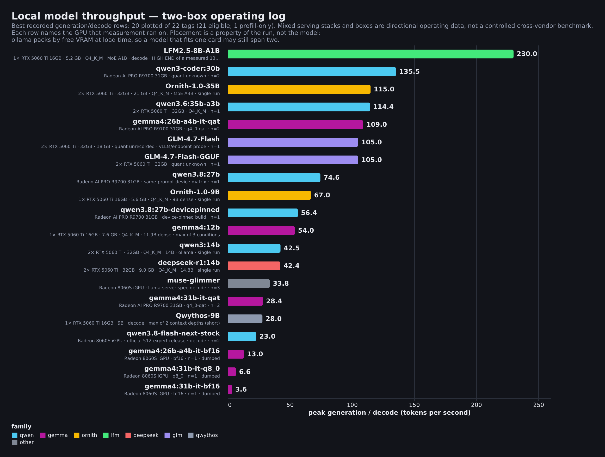
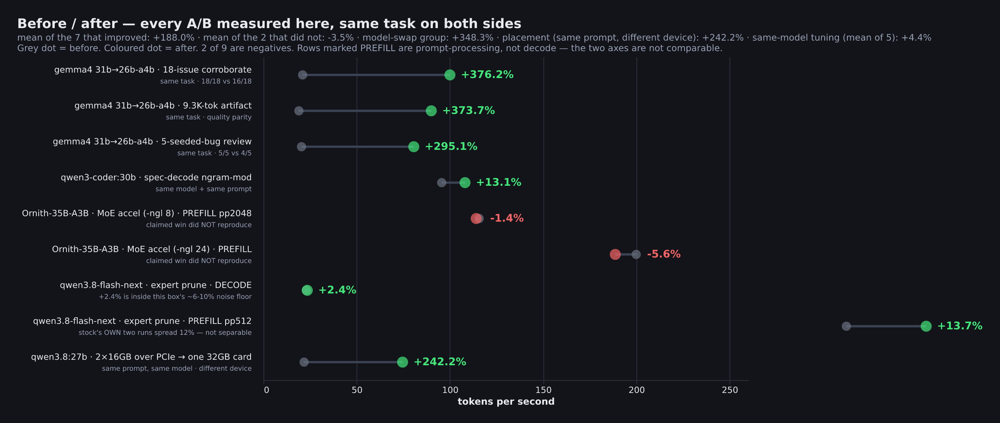
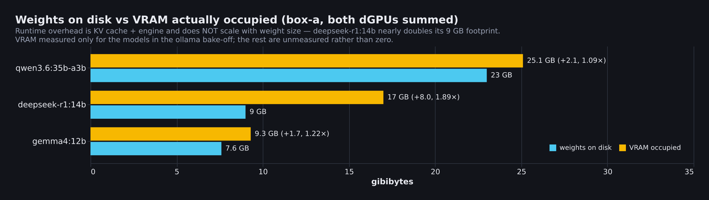

# Agent-FleetOps

Operational tooling and discipline for running a **multi-agent AI engineering fleet** — extracted
and generalized from a working two-workstation setup that routes real engineering work across
frontier cloud models, cheaper cloud tiers, and local GPU models.

The organizing idea, applied everywhere here:

> **A check that cannot fail is indistinguishable from a check that passes.**
> Every guard ships with a way to prove it can go red.

## How the pieces fit

```mermaid
flowchart TD
    W["Fleet activity <br/>local + cloud model legs"] --> T["fleet-tui <br/>OBSERVE - read-only monitor <br/>no model calls, no autonomous actions"]
    W --> G["guard/ <br/>VERIFY - drift guards"]
    TP["teeth_prover <br/>can every guard actually fail?"] -->|proves| G
    G -->|"0 clean / 1 violation / 2 UNMEASURED <br/>(2 dominates 1)"| V{verdict}
    W --> C["curation loop <br/>EVOLVE - propose rule changes"]
    C --> H["human gate <br/>approve / revise / reject"]
    H --> A["deterministic apply <br/>exact-match or refuse"] --> D["second-model diff audit"] --> R["(git - every pass revertible)"]
    style TP fill:#1a3a2a,stroke:#39d36f
    style H fill:#3a2a1a,stroke:#ffb347
```

Observation never mutates, verification must be able to fail, and evolution of the rules
themselves passes a human gate. The three loops share one substrate: everything is a file,
everything is diffable, everything is revertible.

That rule is enforced on this repository itself: the export pipeline's secret scanner and
never-publish wall-checker each carry planted-mutation self-tests, and both caught real defects in
their own first hour (a JSON-style key pattern gap; a hardcoded test that could never fail on
another machine). The commit history tells that story.

## What's here

| Dir | Contents |
|---|---|
| `tui/` | **fleet-tui** — a Textual terminal monitor for a local/cloud model fleet. 22 headless source modules behind a 353-test hermetic suite; strict one-way pipeline (pure readers → pure formatters → app), frozen dataclass contracts, safe-default degradation. CI runs the full suite on every push. |
| `skills/` | **24 generalized agent-discipline procedures** — evaluation integrity, model routing (the living-table method), the local-lane build loop, multi-agent code workflow, research dispatch/verification, memory ops, brain bookkeeping, protected-function guards, blocked-page retrieval, and more. Each encodes failure stories from real operation. |
| `_tools/` | The export pipeline's own gates — provenance wall-checker, secrets/personal-data scanner, and a **ref gate**, all mutation-proven (`--self-test`). The first two ask "is this tree safe to publish?"; the third asks the question they structurally cannot: **"what would a push actually publish?"** A history rewrite is only true of the branch you rewrote — this repo's own rewrite left a clean `main` beside two leftover refs still carrying the trailers and build artifacts the rewrite removed, one `push --all` away from being republished. Content gates scan a worktree; pushes carry refs. |
| `guard/` + pipeline surfaces | **The drift-guard core** — teeth-prover (every guard proven able to fail), contract-agreement across four vocabulary surfaces, 165 hermetic unit gates, and a sandboxing mutation harness that fail-closes without its measurement corpus. `2 = UNMEASURED` dominates `1 = violation` throughout. |

| `specs/` | The multi-agent **driver-lock protocol**, the **curation-loop architecture**, and the verified-system-map pattern. |
| `bench/` | **The throughput operating log** — 30 measurements over 14 local models, with sample sizes attached. See below. |

## Measured on the box

Numbers from the hardware this was built on, across ollama, llama.cpp and llama-server. Published
with sample sizes attached rather than as a benchmark, because **7 of the 14 models were measured
once and nothing exceeds four runs**. `bench/local_model_throughput.csv` carries an
`n_runs_for_model` column so that limit travels with every row instead of living in a caption.
These will be replaced as the sample deepens.

### The box

| | |
|---|---|
| **GPU** | 2 × NVIDIA RTX 5060 Ti, **16 GB GDDR7 each (32 GB total)** · Blackwell, compute capability **12.0 (sm_120)** · driver 595.71.05, CUDA 13.2 |
| **CPU** | AMD Ryzen 7 5800XT — 8 cores / 16 threads, boost ~4.97 GHz |
| **RAM** | 32 GB (30 GB usable) + 8 GB swap |
| **Storage** | 2 TB internal NVMe (BIWIN NV7400) for models and working state; 1 TB USB-attached NVMe SSD for backups |
| **OS** | Ubuntu 26.04 LTS, kernel 7.0 |

**What you'd actually need to reproduce this.** The tier that matters is VRAM, and it is a cliff
rather than a slope — a model either fits or it doesn't:

- **One 16 GB card** covers everything up to the `gemma4:26b-a4b-it-qat` tier (15 GB of weights,
  **100 tok/s** measured, and the model this fleet audits code with). LFM2.5-8B (5.2 GB),
  Ornith-9B (5.6 GB), gemma4:12b (7.6 GB) and deepseek-r1:14b (9.0 GB) all fit comfortably, with
  room left for KV cache. **This is the honest minimum** — most of the useful lanes live here.
- **The second card buys the 30–35B tier.** qwen3.6:35b-a3b is 23 GB of weights and occupies
  **25.1 GB** once loaded, so it spans both cards; Ornith-35B and qwen3-coder:30b are the same
  story. Those are the 108–200 tok/s rows.
- **Budget for runtime overhead, not just weights** — it does not scale with model size. See the
  third chart: one 9 GB model occupies 17 GB loaded.
- **CPU is not the bottleneck** for GPU-resident inference; it matters for loading and for the
  orchestration around the models. System RAM matters more than core count — 32 GB is adequate but
  not generous once several services and a browser are running alongside.
- Model weights are large. Roughly **700 GB** of models and working state on the internal NVMe here.

**Peak decode per model** — weights, quantisation, architecture and run count sit under each name:

**Before / after.** Six A/B pairs measured on the same box, same task. The finding that changed how
this fleet routes work: swapping the audit lane from a 30.7B dense model to a 25.2B MoE averaged
**+348%** across three tasks *at quality parity* — the smaller model also found **more** seeded bugs
(5/5 vs 4/5, 18/18 vs 16/18). Speculative decoding on the same model averaged **+13%**. Routing beats
flag-tuning here, and the gap is an order of magnitude.

The two red rows stay red: a claimed MoE-offload speed-up **did not reproduce** at either offload
level. A record that only keeps its wins is not a record.

**Weights vs VRAM actually occupied.** Runtime footprint does not scale with weight size —
`deepseek-r1:14b` occupies **1.89×** its 9 GB of weights once loaded, while `qwen3.6:35b-a3b`
occupies **1.09×** its 23 GB. Sizing VRAM from model size alone goes badly wrong on the small model.

`bench/make_charts.py` regenerates all three from the CSV, and **fails closed** if the two disagree:
exit 1 on divergence, exit 2 when the CSV is absent — unverifiable is not the same as clean.

## The guard ladder

```mermaid
flowchart LR
    S([run_guards.sh]) --> T1["1. teeth_prover <br/>plant defects, expect red"]
    T1 -->|HAS_TEETH| T2["2. contract_agreement <br/>four surfaces, one vocabulary"]
    T1 -->|VACUOUS / OVERBROAD| X1["STOP - a guard that cannot fail <br/>certifies nothing below it"]
    T2 --> T3["3. unit gates <br/>165 hermetic tests"]
    T3 --> T4[4. leg liveness]
    T4 -->|probed| OK([0 clean])
    T4 -->|dry-run| UM(["2 UNMEASURED <br/>louder than a violation"])
    style X1 fill:#3a1a1a,stroke:#e63946
    style UM fill:#3a2a1a,stroke:#ffb347
```

## Two load-bearing skill patterns

**A report is not an artifact** (from the dispatch/verification skills — both directions):

**Audit the test before trusting it** (from `skills/eval-integrity`):

## Provenance & sanitization

Everything here was exported one-way from a private working system through a gated pipeline:
mechanical sanitization → provenance wall-check → zero-hit secret/personal-data scan → human review
per batch. Paths are genericized; network examples use RFC5737 documentation addresses; measured
numbers are labeled as measured on the reference setup.

Related: [ParaKit](https://github.com/sherifican/ParaKit-Open_Source) — the desktop application whose
multi-agent development workflow drove most of these disciplines into existence.

## License

GPL-3.0 — see LICENSE.
