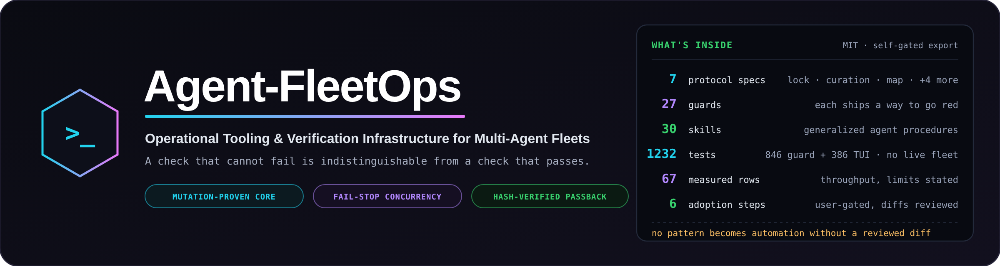
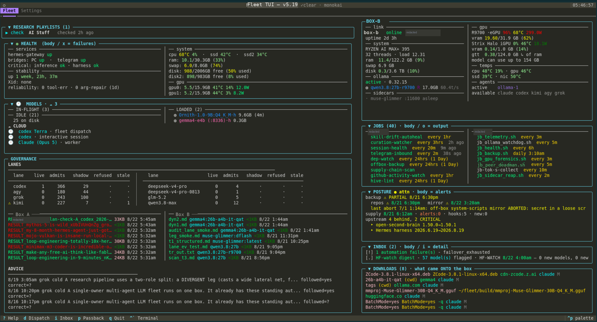
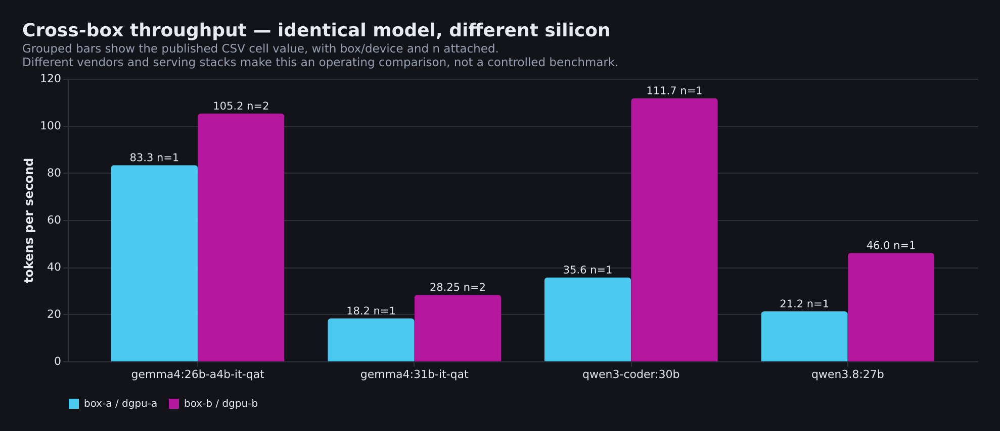
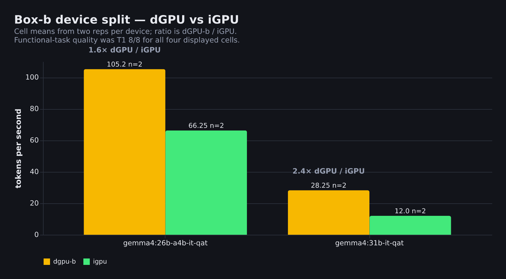

<p align="center">
  
</p>

# Agent-FleetOps

Pattern library for agent fleets: bind every check, count, and claim to a live target that can go red.
It works on one box; the two-workstation setup that produced it is provenance, not a requirement.

The organizing idea, applied everywhere here:

> **A report that cannot fail is indistinguishable from a report that passed.**
> Bind every guard, test, count, path and status to a live target, and run the case that turns it red.

This repo is a pattern library. You do not need two workstations.
**Hand it to your AI:** clone it, then paste the block under **Set it up with your own AI**; the agent records missing GPUs and CLIs as `ABSENT`.
**Read it yourself:** the specs and guards are the same teeth, written so a check can go red.
Start with `eval-integrity`, `generate-review-fix-loop`, and `model-routing-table`; the [minimum viable slice](adopt/README.md#minimum-viable-slice) explains the rest.

## How the pieces fit

```mermaid
flowchart TD
    W["Fleet activity <br/>local + cloud model legs"] --> T["fleet-tui <br/>OBSERVE - read-only monitor <br/>no model calls, no autonomous actions"]
    L["driver lock <br/>SERIALIZE - one writer per tree <br/>(specs/driver-lock-protocol)"] -->|gates writes| W
    W --> G["guard/ <br/>VERIFY - drift guards"]
    TP["teeth_prover <br/>can every guard actually fail?"] -->|proves| G
    G -->|"0 clean / 1 violation / 2 UNMEASURED <br/>(2 dominates 1)"| V{verdict}
    W --> C["curation loop <br/>EVOLVE - propose rule changes"]
    C --> H["user gate <br/>approve / revise / reject"]
    H --> A["deterministic apply <br/>exact-match or refuse"] --> D["second-model diff audit"] --> R["(git - every pass revertible)"]
    style TP fill:#1a3a2a,stroke:#39d36f
    style H fill:#3a2a1a,stroke:#ffb347
```



Observation never mutates, writes serialize behind a lock, verification must be able to fail, and
evolution of the rules themselves passes a user gate. The three loops share one substrate: everything is a file,
everything is diffable, everything is revertible.

That rule is enforced on this repository itself: the export pipeline's secret scanner and
never-publish wall-checker each carry planted-mutation self-tests, and both caught real defects in
their own first hour (a JSON-style key pattern gap; a hardcoded test that could never fail on
another machine). The commit history tells that story.

## What's here

| Dir | Contents |
|---|---|
| `tui/` | **fleet-tui** — a Textual terminal monitor for a local/cloud model fleet. 27 headless source modules (excluding `__init__.py`) behind a 364-test hermetic suite; strict one-way pipeline (pure readers → pure formatters → app), frozen dataclass contracts, safe-default degradation. CI runs the full suite on every push. |
| `skills/` | **Generalized agent-discipline procedures** — evaluation integrity, model routing (the living-table method), the local-lane build loop, multi-agent code workflow, research dispatch/verification, memory ops, brain bookkeeping, protected-function guards, blocked-page retrieval, and more. Each encodes failure stories from real operation. The portable start-list is in [`adopt/20_skills.md`](adopt/20_skills.md); you are not expected to install them all. |
| `templates/` | Copyable dispatch, honesty, pinned-environment, and research-artifact patterns. Templates are adoption patterns, not automatic enforcement. |
| `_tools/` | The export pipeline's own gates — provenance wall-checker, secrets/personal-data scanner, and a **ref gate**, all mutation-proven (`--self-test`). The first two ask "is this tree safe to publish?"; the third asks the question they structurally cannot: **"what would a push actually publish?"** A history rewrite is only true of the branch you rewrote — this repo's own rewrite left a clean `main` beside two leftover refs still carrying the trailers and build artifacts the rewrite removed, one `push --all` away from being republished. Content gates scan a worktree; pushes carry refs. |
| `guard/` + pipeline surfaces | **The drift-guard core** — teeth-prover (every guard proven able to fail), contract-agreement across four vocabulary surfaces, 218 hermetic unit gates, and a sandboxing mutation harness that fail-closes without its measurement corpus, and the [honesty stop hook](specs/honesty-stop-gate.md) in `guard/` that blocks a turn asserting unmeasured live state. `2 = UNMEASURED` dominates `1 = violation` throughout. |
| `specs/` | The multi-agent **driver-lock protocol**, the **curation-loop architecture**, the verified-system-map pattern, and the [research-team](specs/research-team-protocol.md), [rigor-spectrum](specs/rigor-spectrum.md), and [honesty-stop-gate](specs/honesty-stop-gate.md) guides. |
| `bench/` | **The two-box throughput operating log** — 55 measurements over 20 model tags, with sample sizes and device labels attached. See below. |

### fleet-tui, running



A live two-box fleet in one screen with resizable/collapsible cards. Left column is the local box: health, the model kanban
(in-flight / loaded / idle), lane governance, and artifact receipts. Right column is the second box
reached over the LAN — its own GPU/thermal/memory readings, its scheduled jobs beside the local ones,
posture alerts, inbox, and what was downloaded onto which box.

Worth noticing, because it is what the tool is *for*: the second box's dGPU is at **96% / 68°C / 299 W**
serving a 17 GB model at **60.4 tok/s** (a live TUI eval rate, not one of the CSV cells — the logged peak for that tag is 54.4–56.4) while its iGPU sits at 0% / 46°C — two devices, one box, wildly
different states, both visible at a glance. Three cloud legs are in flight next to two resident local
models. An automation failure is surfaced in the inbox rather than buried in a log, and the upstream
panel shows exactly which dependencies are behind.

*Hostnames, LAN addresses and box nicknames are redacted (grey boxes); every reading is real. The header shows a newer in-house build than the `tui/` sources exported here.*

## Research team

Research is a chain of inspectable artifacts, not an answer a model says confidently. The roles,
independence rule, receipt fields, failure handling, and security boundaries are canonical in
[`specs/research-team-protocol.md`](specs/research-team-protocol.md).

| Role | Responsibility | Boundary |
|---|---|---|
| Orchestrator | Frames the question and keeps the second brief blind. | Judgment remains the user's, and accountable. |
| Independent research legs | Retrieve evidence and retain separately named RESULT artifacts. | Agreement is not source verification. |
| Reconciler + verifier | Preserves dissent, then checks claims against the evidence pack. | The verifier is not the producing leg. |
| Actionability pass | Maps findings to the project’s closed vocabulary. | It does not turn a finding into truth. |

### Video research

A video or talk backlog becomes dispatched multi-leg research briefs; legs return contract-checked RESULTs, a reconcile produces one FINAL, and per-project actionability is rated against a closed vocabulary. Findings render as cards on one self-contained hub page, because research you cannot re-find or audit is research you do not have.

**Conceptual — see the status table:** `backlog diff -> stage briefs -> dispatch >=2 legs -> reconcile -> actionability ratings -> hub cards -> (rarely) a Solo-Rich Report`

<!-- HUB SCREENSHOT: owner-provided, pending -->

### Solo-Rich Reports — why they exist

Most findings belong on a card. A finding earns a standalone richly-presented page only by clearing a measurable 2-of-3 gate: cross-leg convergence, actionable density, or real captured media. “Seems interesting” as a trigger produces exactly the bloat this tier exists to avoid; see [`guard/specs/SPEC_solo_rich_report.md`](guard/specs/SPEC_solo_rich_report.md) and [`templates/solo-rich-report.md.template`](templates/solo-rich-report.md.template).

### What's runnable vs contract-only

| Surface | Status |
|---|---|
| Overview + hub template | Template/reference |
| `ACTIONABLE_ADDENDUM.md` | Contract |
| `SPEC_solo_rich_report.md` + solo-rich template | Contract + template |
| `SPEC_odyssey_hub.md` | Design guidance for a DIFFERENT hub (its RAW/RECONCILED data model is NOT the video hub) |
| `stage_video_research.py` + `video_backlog_diff.py` | Runnable, adapter-config required (EDIT ME markers + VIDEO_ROOT) |
| `check_leg_contract.py` + `actionable_rollup.py` | Runnable — RESULT-contract check and per-project actionability rollup |
| `vision_ingest.py` / `vision_motion.py` / `vision_semantic.py` | Root pipeline modules addressed by fixed path from `guard/` and `guard/mutation_harness.py`; exercised by the guard layer, not standalone entry points |
| Deterministic hub/solo-rich renderers | Not supplied yet (follow-up) |

### Security and delivery integrity

| Defense | Component | Adopter proof it can fail | Invocation boundary |
|---|---|---|---|
| Retain worker output | [`dispatch-wrapper`](templates/dispatch-wrapper.sh.template) | empty output or nonzero exit with an artifact | The template marks artifacts; it does not invoke transaction or contract checks. |
| Check result vocabulary | [`check_leg_contract.py`](check_leg_contract.py) | missing relevance line or invented verb | Run after a RESULT is produced. |
| Atomic replacement | [`artifact_txn.py`](guard/artifact_txn.py) | validator or commit failure | Separate component, not wrapper wiring. |
| Detect contract drift | [`contract_agreement.py`](guard/contract_agreement.py) | one of four vocabulary surfaces diverges | Pre-dispatch/release guard, not evidence verification. |
| Treat a leg as adversarial | [research protocol](specs/research-team-protocol.md) | retained artifact contradicts a report | Operating pattern, not an enforced guard. |

The research skills describe failure modes—premise leakage, consensus laundering, skipped verification,
and invalid evaluation signals—not capabilities automatically granted by copying a directory.

**If you only take one thing:** retain independent artifacts and make a different worker verify claims before actionability.

## Set it up with your own AI

Clone this repository, then point your orchestrator at `adopt/README.md`. The agent will inventory the host, propose a local configuration from those observations, show the user the plan and diffs before any service, cron entry, or shell hook, and run the available verification steps. The adoption path degrades to a single box with no GPU or cloud CLI; absent capabilities are recorded rather than guessed. The `adopt/` documents are written for an agent with shell access.

```text
Read adopt/README.md and follow it in order. Inventory this host before prescribing configuration. Show me the plan and diffs before installing any cron entry, service, or shell hook, then retain the literal verification output.
```

## Measured on two boxes

**What you'd actually need to reproduce this.** The tier that matters is VRAM, and it is a cliff
rather than a slope — a model either fits or it doesn't:

- **One 16 GB card** covers everything up to the `gemma4:26b-a4b-it-qat` tier (15 GB of weights,
  **100 tok/s** measured — the tier the audit lane ran in when these charts were made; the review leg itself
  is re-derived as hardware and roster change, best model on the fastest capable GPU, never
  pinned to one tag). LFM2.5-8B (5.2 GB),
  Ornith-9B (5.6 GB), gemma4:12b (7.6 GB) and deepseek-r1:14b (9.0 GB) all fit comfortably, with
  room left for KV cache. **This is the honest minimum** — most of the useful lanes live here.
- **The second card buys the 30–35B tier.** qwen3.6:35b-a3b is 23 GB of weights and occupies
  **25.1 GiB** once loaded, so it spans both cards — directly confirmed by loading it: Ornith-35B
  sits at 11839 / 11323 MiB and GLM-4.7-Flash at 11447 / 10789 MiB, both across the pair, because
  neither fits in one 16 GiB card at all. Ornith-35B and qwen3-coder:30b are the same
  story. On decode those two-card rows land at ~105–115 tok/s (the higher figures that used to sit here were prompt-processing, not decode).
- **Budget for runtime overhead, not just weights** — it does not scale with model size. See the
  third chart: one 9 GB model occupies 17.0 GiB loaded, summed across both cards.
- **CPU is not the bottleneck** for GPU-resident inference; it matters for loading and for the
  orchestration around the models. System RAM matters more than core count — 32 GB is adequate but
  not generous once several services and a browser are running alongside.
- Model weights are large. Hundreds of GB of models and working state on the internal NVMe here (not inventoried in this export).
- **Neither the platform nor the PCIe links need to be top-shelf.** This is an AM4 board (MSI B550
  Tomahawk Max) feeding one card at **PCIe 4.0 x8** and the other at **PCIe 3.0 x4**, with the
  deliberately mismatched DRAM above settling at 2933 MT/s. Every **box-a** number in the charts was measured
  through exactly those links; the cross-box and device-split panels also carry box-b values, which
  run on that machine's own unified-memory path. Once weights are resident, decode traffic barely touches the bus —
  the choked links show up as slower model *loads*, not slower *inference* — and even the models
  that span both cards hit their published rates across a 3.0 x4 link. Mismatched, mainstream,
  lane-starved hardware is sufficient; the VRAM cliff above is the only spec that gates anything.

This operating log now records `box-a` and `box-b`: different vendors, serving stacks, and device
paths. Every CSV row has `box`, `device`, `quant`, `serving_stack`, `quality_score`, `verdict` columns —
many values are blank, because a blank is more honest than a value reconstructed after the fact —
and `n_runs_for_model` so the sample size stays attached to the number. Some rows are single-run.
This is not a controlled cross-vendor benchmark; it is a transparent record for operating decisions,
with its limits visible.

**Best recorded row per model** — each row names **the GPU that measurement actually ran on**,
then quantisation and run count. Placement is a property of the run rather than of the model:
ollama packs by free VRAM at load time, so a model small enough for one card may still be split
across two. Measured 2026-08-22 on Box A: `ornith:9b` is 5.6 GB and fits one card comfortably, yet
loaded as 5435 / 5315 MiB across both, while `lfm:8b` at 5.2 GB stayed on a single card.


**Before / after.** Six A/B pairs measured on the same box, same task. The finding that changed how
this fleet routes work: swapping the audit lane from a 30.7B dense model to a 25.2B MoE averaged
**+348%** across three tasks *at equal-or-better seeded-bug recall* — the smaller model also found **more** seeded bugs
(5/5 vs 4/5, 18/18 vs 16/18). Speculative decoding on the same model averaged **+13%**. Routing beats
flag-tuning here, and the gap is an order of magnitude. The lane has since been re-derived on
newer hardware under the standing rule — the best model on the fastest capable GPU, thinking on
for audit passes — where a dense 27B came within ~6% on throughput of the 25.2B-parameter MoE
(tagged `26b`) on the same device (58.8 vs 62.2 tok/s, same audit prompt, timed with the
serving runtime's per-run stats, e.g. `ollama run <tag> --verbose`). The dense model is the
slower of the two and is chosen for audit quality, not speed. The A/B rows above remain as
the evidence the rule rests on.

The two red rows stay red: a claimed MoE-offload speed-up **did not reproduce** at either offload
level. A record that only keeps its wins is not a record.


**Weights vs VRAM actually occupied.** Runtime footprint does not scale with weight size —
`deepseek-r1:14b` occupies **1.89×** its 9 GB of weights once loaded, while `qwen3.6:35b-a3b`
occupies **1.09×** its 23 GB. Sizing VRAM from model size alone goes badly wrong on the small model.
This panel is box-a-only, where those measurements exist.


**Cross-box.** The headline comparison places identical model tags on box-a and box-b, grouped by box/device.
The bars do not turn differing stacks into a controlled benchmark.



**Box-b device split.** Four models, each measured on both of Box B's GPUs in one sitting by the same
harness — same prompt, context pinned on both devices, model unloaded in between so the second
reading cannot silently reuse the first device. Each bar states its sample size.



`bench/device_split_bench.py` is the written-down method for those eight cells — the originals came from an ad-hoc command on the second box, and this file is that protocol recorded so the comparison can be
re-run rather than taken on trust. It drives one model onto each GPU through `options.main_gpu`,
discards a warm-up so model-load time is not counted as decode rate, and **unloads between devices** —
without that, the second request quietly reuses the copy already resident on the first device and the
run reports that device twice, which is the exact failure the benchmark exists to detect.

`bench/make_charts.py` regenerates all five images from the CSV, and **fails closed** if the two disagree:
exit 1 on divergence, exit 2 when the CSV is absent — unverifiable is not the same as clean.

### The boxes

Published so a reader can size their own hardware against the numbers. **Box A is deliberately
mismatched, mainstream, lane-starved hardware** — that is the point, not an apology.

#### Box A — where the original charts were measured

| | |
|---|---|
| **GPU** | 2 × NVIDIA RTX 5060 Ti, **16 GB GDDR7 each (32 GB total)** · Blackwell, compute capability **12.0 (sm_120)** · driver 595.71.05, CUDA 13.2 toolkit (one llama.cpp binary in the log was built against 13.3) |
| **CPU** | AMD Ryzen 7 5800XT — 8 cores / 16 threads, rated boost 4.8 GHz (≈4.97 GHz observed under PBO) |
| **Motherboard** | MSI MAG B550 TOMAHAWK MAX WIFI — **AM4**, a mainstream 2020-era board. One GPU runs at **PCIe 4.0 x8**, the other at **PCIe 3.0 x4** (chipset slot). Neither gets a full x16 link. |
| **RAM** | 32 GB DDR4 (30 GB usable) + 8 GB swap — 4 × 8 GB at **2933 MT/s**. Deliberately mismatched: 3 × DDR4-3200 CL16 single-rank + 1 × DDR4-3000 CL15 dual-rank, so the controller settles below both kits' ratings. |
| **Storage** | 2 TB internal NVMe for models and working state; 1 TB USB-attached NVMe for backups |
| **OS** | Ubuntu 26.04 LTS, kernel 7.0 |

#### Box B — the second box (added 2026-08-22)

| | |
|---|---|
| **APU** | AMD Ryzen AI MAX+ 395 ("Strix Halo") — 32 threads, with integrated **Radeon 8060S** graphics |
| **Discrete GPU** | **AMD Radeon AI PRO R9700** (Navi 48, RDNA 4, `gfx1201`) — **~31.9 GiB** usable VRAM (32624 MiB measured; 32 GB SKU) |
| **iGPU** | Radeon 8060S on **unified memory** — the same pool as system RAM, so "VRAM" is an allocation, not a fixed partition |
| **Memory** | **122 GiB LPDDR5-8000**, shared between CPU and iGPU |
| **Chassis** | GMKtec EVO-X3 mini-PC |
| **Serving stack** | ollama 0.32.15 over **Vulkan (RADV)** — *not* CUDA, a different kernel path from Box A entirely |
| **OS** | Ubuntu 26.04 LTS, kernel 7.0 (Server Edition) |

Server Edition headless setup allows for the maximum amount of resources can be allocated to compute instead of a desktop. Box A controls Box B over ssh.

**Why the two boxes are not a controlled comparison.** They differ in vendor (NVIDIA/CUDA vs
AMD/Vulkan), memory architecture (discrete VRAM vs a unified pool), and serving stack. A row that is
faster on Box B is not evidence that AMD beats NVIDIA — it is evidence that *this model, at this
quantisation, on this stack* ran at that rate. The value of publishing both is the **shape**: which
models tolerate an iGPU, where the dGPU/iGPU gap actually lands, and which quantisations are worth
keeping. Read the `device` and `serving_stack` columns before comparing any two rows.

**The gap splits by architecture, not by size.** Across the four models measured on both devices,
the ratio lands in two tight groups — and they are not the groups you would guess from parameter
count:

| model | params | experts (GGUF metadata) | dGPU / iGPU |
|---|---|---|---|
| `qwen3-coder:30b` | 30.5B | 128, 8 used | **1.63×** |
| `gemma4:26b-a4b-it-qat` | 25.2B | 128, 8 used | **1.63×** |
| `qwen3.8:27b` | 27.3B | none — dense | **2.30×** |
| `gemma4:31b-it-qat` | 30.7B | none — dense | **2.36×** |

The expert counts are read from each model's GGUF metadata, not inferred from its name. The two
sparse models carry the *same* configuration — 128 experts, 8 used — from different vendors, and
land on the same ratio to two decimal places; both dense models sit near 2.3×.

The likely mechanism is that a sparse model does less arithmetic per token, so it is less punished
by the iGPU's weaker compute, while both architectures pay the same memory-bandwidth penalty — but
that is the explanation the numbers *suggest*, not something this benchmark isolates. Two models
per group is thin evidence for a rule. What it is good enough for is a routing default: **if a job
has to run on the iGPU, prefer the sparse model.**

**The iGPU is the interesting result.** A 26B MoE at **67 tok/s on integrated graphics** — using a
slice of the same LPDDR5 the CPU is using — is the row most likely to change what someone buys, because
it needs no discrete card at all.

## The guard ladder


### The honesty stop gate — a guard that watches the agent's words

The ladder above proves *artifacts* can fail visibly. One guard turns the same law on the agent's own
claims: a [**Stop hook**](specs/honesty-stop-gate.md) that refuses to end a turn asserting live state
("the job is running", "all three legs completed") the turn never measured. It reads the current turn,
finds live-state claims in the prose and verification commands in the tool calls, and blocks when a
claim has no same-turn, same-subject check — because reporting an *intention* as an *observation* feels
identical from the inside and no advisory rule catches it. It carries its own teeth (`--self-test`
proves it still blocks an unbacked claim and passes a backed one), and adapting it to another stack is
a guided step, not a copy-paste: [`skills/honesty-stop-gate`](skills/honesty-stop-gate/SKILL.md) forces
the adopting AI to confirm every verification command actually exists on the target box — a check
pointed at a missing command is a stair to nowhere that reads as coverage and delivers none.

### Same teeth, different rung count

The laws are the same; consequence and reversibility decide the rung count. See the canonical
[rigor spectrum](specs/rigor-spectrum.md) before importing a larger inventory.

| Pattern-library workflow | User-facing app, updater, or long-lived corpus |
|---|---|
| Prove a few guards can fail; add a guard after a named failure mode. | Keep the same base, then add release rehearsals and broader invariants for the actual blast radius. |
| Accept a narrowly scoped check that rejects its unknowns. | Rehearse cross-surface and rollback failures before release. |
| Stop after five copied practices when the project is reversible. | Fund more rungs when users, self-updates, or irreversible corpus changes justify them. |

**If you only take one thing:** copy the five baseline practices in the rigor guide, then add rungs only for a named risk.

## Two critical skill patterns

**A report is not an artifact** (from the dispatch/verification skills — both directions):


### Why the routing table looks like that

Routine bounded labor is local-first; decompose before escalation; choose the cheapest capable role;
use cloud as support; apply token thrift to metered cloud work, not free local generation; and gate
effort bumps with evidence. The canonical procedures remain [`model-routing-table`](skills/model-routing-table/SKILL.md)
and [`fleet-model-routing`](skills/fleet-model-routing/SKILL.md); use the [routing decision record](templates/routing-decision-record.md.template) to record a local choice.

| Posture | Route | Stop paying for |
|---|---|---|
| One subscription, no GPU | Standing-effort subscription; draft/review as roles | unattended high-effort loops and spare APIs |
| +1 16 GB GPU | Local routine work; cloud review or hard/long work | paid boilerplate generation |
| +2nd cloud subscription | Use only for independent or capacity-bound work | duplicate default labor |
| Two boxes | Local labor on both; cloud support/escalation | cloud orchestration plus routine cloud legwork |

**If you only take one thing:** record why a route earned escalation and what evidence would change it.

**Audit the test before trusting it** (from `skills/eval-integrity`):

```mermaid
flowchart TD
    E[an eval says PASS] --> Q1{"could ground truth <br/>leak into input or scoring?"}
    Q1 -->|yes| INF["INFLATED - fix the leak first"]
    Q1 -->|no| Q2{"has the CONTROL been seen failing? <br/>clean - current - reachable"}
    Q2 -->|no| DEC["a check nobody watched fail <br/>is decoration, not evidence"]
    Q2 -->|yes| Q3{"eyeballed raw inputs <br/>and outputs?"}
    Q3 -->|yes| T([trust the result])
    style DEC fill:#3a1a1a,stroke:#e63946
    style INF fill:#3a1a1a,stroke:#e63946
```



## Provenance & sanitization

Everything here was exported one-way from a private working system through a gated pipeline:
mechanical sanitization → provenance wall-check → zero-hit secret/personal-data scan → user review
per batch. Paths are genericized; network examples use RFC5737 documentation addresses; measured
numbers are labeled as measured on the reference setup.

Related: ParaKit — the desktop application whose
multi-agent development workflow drove most of these disciplines into existence.

## Prior art & adaptations

Not everything here was invented from scratch. Much of this repo's value is in **assembling, hardening,
and generalizing** techniques — and several components are adapted from, or build on, existing
open-source work. Each is credited inline where it lives; consolidated here:

- **Odyssey Hub** (`odyssey_crawl_hub.py` and its editorial presentation) — the deterministic "the model
  emits markdown, a renderer styles it" design and its visual treatment are **adapted from Odysseus**,
  PewDiePie's multi-agent workspace tool (specifically its `visual_report.py`). The name deliberately
  stays in that family; the data model and the fleet pipeline around it are ours.
- **Solo-Rich Report** — the long-form writer scaffold is adapted from **Tongyi WebWeaver**.
- **Leg-failure classification** — adapted from **opencode**'s retry classifier (`session/retry.ts`).
- **`guard/` verification stack** — adapted from the `_breaker/` layer of the desktop application this
  project was exported from.

If we've adapted your work and the credit here is wrong or missing, open an issue — we'd rather correct
it than leave it implicit.

## License

MIT — see LICENSE.
