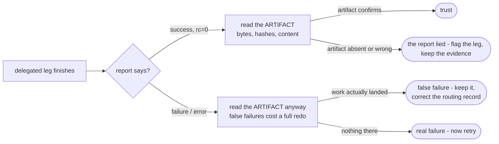

# Agent-FleetOps

Operational tooling and discipline for running a **multi-agent AI engineering fleet** — extracted
and generalized from a working two-workstation setup that routes real engineering work across
frontier cloud models, cheaper cloud tiers, and local GPU models.

The organizing idea, applied everywhere here:

> **A check that cannot fail is indistinguishable from a check that passes.**
> Every guard ships with a way to prove it can go red.

## How the pieces fit

```mermaid
flowchart TD
    W[Fleet activity<br/>local + cloud model legs] --> T[fleet-tui<br/>OBSERVE - read-only monitor<br/>no model calls, no autonomous actions]
    W --> G[guard/<br/>VERIFY - drift guards]
    TP[teeth_prover<br/>can every guard actually fail?] -->|proves| G
    G -->|"0 clean / 1 violation / 2 UNMEASURED<br/>(2 dominates 1)"| V{verdict}
    W --> C[curation loop<br/>EVOLVE - propose rule changes]
    C --> H[human gate<br/>approve / revise / reject]
    H --> A[deterministic apply<br/>exact-match or refuse] --> D[second-model diff audit] --> R[(git - every pass revertible)]
    style TP fill:#1a3a2a,stroke:#39d36f
    style H fill:#3a2a1a,stroke:#ffb347
```

Observation never mutates, verification must be able to fail, and evolution of the rules
themselves passes a human gate. The three loops share one substrate: everything is a file,
everything is diffable, everything is revertible.

That rule is enforced on this repository itself: the export pipeline's secret scanner and
never-publish wall-checker each carry planted-mutation self-tests, and both caught real defects in
their own first hour (a JSON-style key pattern gap; a hardcoded test that could never fail on
another machine). The commit history tells that story.

## What's here

| Dir | Contents |
|---|---|
| `tui/` | **fleet-tui** — a Textual terminal monitor for a local/cloud model fleet. 22 headless source modules behind a 353-test hermetic suite; strict one-way pipeline (pure readers → pure formatters → app), frozen dataclass contracts, safe-default degradation. CI runs the full suite on every push. |
| `skills/` | Generalized agent-discipline procedures: evaluation integrity, blocked-page retrieval, dependency sequencing, actionability triage, brainstorm panels, curation auditing, file organization. Each encodes failure stories from real operation. |
| `_tools/` | The export pipeline's own gates — provenance wall-checker and secrets/personal-data scanner, both mutation-proven (`--self-test`). |

| `guard/` + pipeline surfaces | **The drift-guard core** — teeth-prover (every guard proven able to fail), contract-agreement across four vocabulary surfaces, 165 hermetic unit gates, and a sandboxing mutation harness that fail-closes without its measurement corpus. `2 = UNMEASURED` dominates `1 = violation` throughout. |

Coming in later batches: the multi-agent
driver-lock protocol spec, dispatch-harness templates, and the curation-loop architecture.

## The guard ladder

## Two load-bearing skill patterns

**A report is not an artifact** (from the dispatch/verification skills — both directions):

**Audit the test before trusting it** (from `skills/eval-integrity`):

## Provenance & sanitization

Everything here was exported one-way from a private working system through a gated pipeline:
mechanical sanitization → provenance wall-check → zero-hit secret/personal-data scan → human review
per batch. Paths are genericized; network examples use RFC5737 documentation addresses; measured
numbers are labeled as measured on the reference setup.

Related: [ParaKit](https://github.com/sherifican/ParaKit-Open_Source) — the desktop application whose
multi-agent development workflow drove most of these disciplines into existence.

## License

GPL-3.0 — see LICENSE.
