# Agent-FleetOps

Operational tooling and discipline for running a **multi-agent AI engineering fleet** — extracted
and generalized from a working two-workstation setup that routes real engineering work across
frontier cloud models, cheaper cloud tiers, and local GPU models.

The organizing idea, applied everywhere here:

> **A check that cannot fail is indistinguishable from a check that passes.**
> Every guard ships with a way to prove it can go red.

## How the pieces fit

```mermaid
flowchart TD
    W["Fleet activity <br/>local + cloud model legs"] --> T["fleet-tui <br/>OBSERVE - read-only monitor <br/>no model calls, no autonomous actions"]
    W --> G["guard/ <br/>VERIFY - drift guards"]
    TP["teeth_prover <br/>can every guard actually fail?"] -->|proves| G
    G -->|"0 clean / 1 violation / 2 UNMEASURED <br/>(2 dominates 1)"| V{verdict}
    W --> C["curation loop <br/>EVOLVE - propose rule changes"]
    C --> H["human gate <br/>approve / revise / reject"]
    H --> A["deterministic apply <br/>exact-match or refuse"] --> D["second-model diff audit"] --> R["(git - every pass revertible)"]
    style TP fill:#1a3a2a,stroke:#39d36f
    style H fill:#3a2a1a,stroke:#ffb347
```

Observation never mutates, verification must be able to fail, and evolution of the rules
themselves passes a human gate. The three loops share one substrate: everything is a file,
everything is diffable, everything is revertible.

That rule is enforced on this repository itself: the export pipeline's secret scanner and
never-publish wall-checker each carry planted-mutation self-tests, and both caught real defects in
their own first hour (a JSON-style key pattern gap; a hardcoded test that could never fail on
another machine). The commit history tells that story.

## What's here

| Dir | Contents |
|---|---|
| `tui/` | **fleet-tui** — a Textual terminal monitor for a local/cloud model fleet. 28 headless source modules behind a 364-test hermetic suite; strict one-way pipeline (pure readers → pure formatters → app), frozen dataclass contracts, safe-default degradation. CI runs the full suite on every push. |
| `skills/` | **24 generalized agent-discipline procedures** — evaluation integrity, model routing (the living-table method), the local-lane build loop, multi-agent code workflow, research dispatch/verification, memory ops, brain bookkeeping, protected-function guards, blocked-page retrieval, and more. Each encodes failure stories from real operation. |
| `_tools/` | The export pipeline's own gates — provenance wall-checker, secrets/personal-data scanner, and a **ref gate**, all mutation-proven (`--self-test`). The first two ask "is this tree safe to publish?"; the third asks the question they structurally cannot: **"what would a push actually publish?"** A history rewrite is only true of the branch you rewrote — this repo's own rewrite left a clean `main` beside two leftover refs still carrying the trailers and build artifacts the rewrite removed, one `push --all` away from being republished. Content gates scan a worktree; pushes carry refs. |
| `guard/` + pipeline surfaces | **The drift-guard core** — teeth-prover (every guard proven able to fail), contract-agreement across four vocabulary surfaces, 165 hermetic unit gates, and a sandboxing mutation harness that fail-closes without its measurement corpus. `2 = UNMEASURED` dominates `1 = violation` throughout. |
| `specs/` | The multi-agent **driver-lock protocol**, the **curation-loop architecture**, and the verified-system-map pattern. |
| `bench/` | **The two-box throughput operating log** — 47 measurements over 20 model tags, with sample sizes and device labels attached. See below. |

## Measured on two boxes

This operating log now records `box-a` and `box-b`: different vendors, serving stacks, and device
paths. Every CSV row carries `box`, `device`, `quant`, `serving_stack`, `quality_score`, `verdict`,
and `n_runs_for_model` so the sample size stays attached to the number. Some rows are single-run.
This is not a controlled cross-vendor benchmark; it is a transparent record for operating decisions,
with its limits visible.

**Best recorded row per model** — box, device, quantisation, and run count sit under each name:

**Before / after.** Six same-box, same-task A/B pairs remain in the log, including the two published negatives.

**Weights vs VRAM actually occupied.** This panel is box-a-only, where those measurements exist.

**Cross-box.** The headline comparison places identical model tags on box-a and box-b, grouped by box/device.
The bars do not turn differing stacks into a controlled benchmark.

**Box-b device split.** The paired models show the dGPU-to-iGPU ratio from their two-rep cell means.
Each bar states its sample size.

`bench/make_charts.py` regenerates all five images from the CSV, and **fails closed** if the two disagree:
exit 1 on divergence, exit 2 when the CSV is absent — unverifiable is not the same as clean.

## The guard ladder

## Two load-bearing skill patterns

**A report is not an artifact** (from the dispatch/verification skills — both directions):

**Audit the test before trusting it** (from `skills/eval-integrity`):

## Provenance & sanitization

Everything here was exported one-way from a private working system through a gated pipeline:
mechanical sanitization → provenance wall-check → zero-hit secret/personal-data scan → human review
per batch. Paths are genericized; network examples use RFC5737 documentation addresses; measured
numbers are labeled as measured on the reference setup.

Related: [ParaKit](https://github.com/sherifican/ParaKit-Open_Source) — the desktop application whose
multi-agent development workflow drove most of these disciplines into existence.

## License

GPL-3.0 — see LICENSE.
