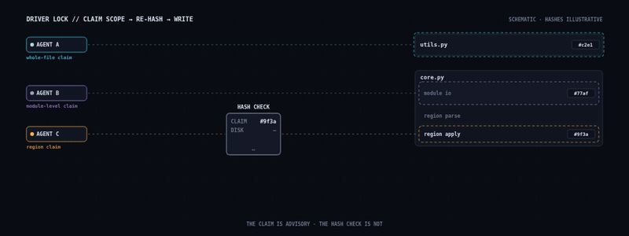

# Driver-Lock Protocol for Concurrent AI Coding Agents

> Origin: developed for ParaKit, an open-source desktop application, during
> multi-agent development.

## Problem statement

Git branches and pull requests record and review changes, but they do not by
themselves coordinate two live agents that share a working tree. In particular,
they do not prevent one agent from saving over another agent's in-progress
edit, or warn an agent that its cached view became stale after a concurrent
save. This protocol adds a small repository-local coordination record and a
write-time integrity check for those live-collision cases.

## Shipped default: one coder per repository

The concurrent paths below are a reference design. The shipped, gated default is simpler: **one
coder per repository**, and it has two mechanisms in this order.

**1. An atomic lock, and it is the gate.** A dirty-tree snapshot is not a one-writer gate: two
jobs that both look at the same CLEAN tree both see nothing to refuse, both proceed, and both
write. Measured, on one tree, both calls returning proceed. So the shipped proceed path is
winning an exclusive create (`O_CREAT|O_EXCL`) on a lock file that records the OWNER, the SCOPE
(the claimed paths), the pid and the time. Exactly one contender can win, whatever the tree looks
like. The winner holds it for the transaction and releases it afterwards; only the owner may
release it. A lock whose holder process is gone is reported STALE and is **not** broken
automatically — an auto-breaking lock is a lock with a social off-switch — so clearing one is an
explicit operator action that refuses while the holder is alive.

**2. The dirty-tree refusal, evaluated under the lock.** A working tree carrying another job's
dirty files means someone edited without the lock, and the pass still refuses to start — commit
or stash between passes. The refusal names only real paths, verbatim from the version-control
ledger and never assembled: only a rename or copy carries an original path, so splitting every
status line on ` -> ` fabricated a path that did not exist out of a file literally NAMED
`foo -> bar.txt`. A path that is dirty because it was DELETED is named as a deletion, not as a
file to go and look at, and a claim given as an absolute path is normalized to the ledger's
root-relative form instead of being refused as foreign.

Enforcement and gate: `guard/one_writer_gate.py` and `guard/tests/test_one_writer_gate.py` (the
gate races contenders and proves exactly one acquires, proves the refusal fires on a foreign dirty
file, and checks every named path against the filesystem rather than by re-running the parser
under test).

## The lock file

Place one lock file at the repository root. The concrete origin used
`.parakit_driver_lock`; this specification uses `.driver_lock` in its examples.
Its presence signals an in-flight edit. Before an agent edits, it reads the
lock and applies the contention rules below. If no lock exists, the agent
writes its own lock before its first edit. The lock includes every intended
file, the agent identifier, the current UTC timestamp, a one-line task
description, and a scope entry for each claimed file.

The source schema is YAML. The following is schema-faithful while using generic
example values:

```yaml
ai: agent-a
session_start: 2026-05-01T14:30:00Z
task: "short task description"
files_claimed:
  - "src/example.py"
  - "docs/example.md"
scope:
  src/example.py:
    type: regions          # whole_file | module_level | regions
    regions:
      - build_view
      - convert_one_item
  docs/example.md:
    type: whole_file
notes: "why this claim is compatible, or what remains serialized"
```

The lifecycle is claim, work, release. At the end of a driver session—whether
the patch is ready for review or work is paused—the driver deletes the lock or
replaces it with the handoff target's lock. It must not leave a stale lock. A
lock older than four hours is a warning: ask permission before deleting or
replacing it.

## Scope granularities

- `whole_file` is an exclusive claim on an entire file. Use it when uncertain,
  when the patch spans the file, or for refactors, renamed cross-referenced
  helpers, and large features.
- `module_level` claims top-of-file edits outside class bodies: imports,
  module-level constants, module-level helpers, and dataclass definitions. It
  excludes material inside a class body.
- `regions` claims named top-level functions, classes, or class methods. A
  region extends from its `def` or `class` line through the dedent returning to
  the enclosing baseline; adjacent comments and blank lines travel with the
  region claim.

## Strict isolation for concurrent region claims

> **Reference design — not shipped.** This section and the write-time region re-hash below
> describe the origin protocol. The lock schema above carries no lock-time hash field, so the
> re-hash cannot be implemented from this document alone; completing it needs the hash
> algorithm, a region locator, and a lock-time digest per claimed region in the schema, plus a
> two-writer test (an agent's own prior write passes; a foreign write halts). Until an adopter
> completes that, the shipped one-coder default above is the supported path.

Two agents may edit one file concurrently only when all of these conditions
hold:

1. Their declared region lists share no name.
2. Neither claims `module_level` while the other claims regions that read
   module-level constants, helpers, or imports.
3. Neither edits `__init__` or a method mutating `self.<attr>` while the other
   edits methods reading that attribute.
4. Neither renames a function, method, class, or constant referenced by the
   other side.
5. Neither changes a function or method signature whose call sites are inside
   the other side's regions.

Apply the order test: “If my patch and theirs are applied in either order, do
both produce the same final file?” If not, upgrade the claim to `whole_file`
and serialize. Region claims are an affirmative isolation assessment, not the
default. If work expands outside the declared scope, stop, expand the lock or
upgrade it to `whole_file`, then continue; do not silently extend the patch.

## Contention paths

Apply these rules in order:

1. With no file overlap, proceed.
2. If overlapping claims include `whole_file`, stop, surface the conflict, and
   wait for the current driver to release.
3. If one overlapping claim is `module_level` and the other touches code that
   reads module-level state, stop; treat it as a whole-file overlap.
4. If both use `regions` and every strict-isolation condition holds, record
   parallel locks and proceed without scope creep.
5. If both use `regions` but isolation fails, stop and surface the unsafe
   overlap.

> Paths 4–5 belong to the reference design marked above; under the shipped one-coder default a
> second concurrent claim never arises.

The source describes serialization and user-directed recovery. It does not
document a fork-and-reconcile mechanism. Accordingly, this specification does
not prescribe one; its implementation status cannot be established here.

## Write-time verification

Before every write to a locked file, perform all applicable checks:

1. Check for a repository-root halt sentinel. If present, stop and do not
   write.
2. Check that the lock still exists and still identifies the same agent and
   session timestamp, and that the file remains in `files_claimed`. If it was
   removed, replaced, or narrowed, stop, write a halt sentinel, and surface
   the situation.
3. For `regions` claims, re-hash each claimed region before the write. If a
   region's current hash differs from the stored lock-time hash and that
   change was not made by the current agent, stop, write a halt sentinel, and
   surface the situation. (This step needs a lock-time digest the schema above
   does not carry — see the reference-design note.)

The origin calls the lock the cross-agent source of truth and calls this
integrity check the safety net for cases the lock process can miss—for example,
an agent ignoring the protocol or acting on a stale file view. It does **not**
describe the lock claim as merely advisory. The content hash is evidence of a
region's unchanged state at the point of the check; it is required only for
`regions` claims in the documented protocol.



*Illustrative animation — timings and hashes are synthetic, not fleet data.*

## Fail-stop: the halt sentinel

The halt sentinel carries collision evidence in YAML. A generic equivalent is:

```yaml
detected_by: agent-a
detected_at: 2026-05-01T15:30:00Z
file: "src/example.py"
my_lock_session_start: 2026-05-01T14:30:00Z
my_scope:
  type: regions
  regions:
    - build_view
overlap_evidence:
  - region: build_view
    last_known_hash: "<sha256-prefix>"
    current_hash: "<sha256-prefix>"
    diff_summary: "5 lines added, 2 lines removed since I locked"
other_active_locks: |
  <copy of the lock contents at detection time, if any>
notes: |
  Unexpected modification detected in a locked region. All writes halt.
  Review the diff, select recovery action, then clear the sentinel.
```

A sentinel is triggered when the lock no longer belongs to the writing session,
when its file claim has been removed, or when a claimed region's unexpected
hash change is found. It is binding until cleared by the project authority.
While it is active, no agent writes the affected file, including agents not
responsible for the collision. The recovery authority reads the sentinel,
inspects the actual changes with version-control status and diff tools, chooses
to keep one edit, keep both if compatible, or roll both back; restores that
state; deletes the sentinel; removes stale rolled-back locks; and has affected
agents repeat their pre-edit synchronization before resuming.

## Failure modes and limits

The source identifies risks this protocol is designed to catch before silent
corruption: an agent ignoring the process, missing synchronization automation,
and a regression patch made from a stale file view. It also identifies silent
overwrite as the consequence of a false-positive parallel region claim and
warns that locks can become stale after four hours.

No source passage supplied for this specification records a specific
collision that the protocol actually caught. Therefore this document makes no
historical-capture claim. It also does not establish protection against an
agent that ignores a binding halt, a process that cannot write/read the lock,
or a non-region conflict that passes the stated claim checks; those cases are
outside the documented guarantees.

## Minimal adoption guide

Adopt the shipped default first — one coder per repository, enforced by the dirty-tree refusal
(`guard/one_writer_gate.py`). The numbered steps below are the reference design; implementing
steps 2–5 requires closing the schema gap noted above.

For a two-agent team, implement the following in order:

1. Define one repository-root YAML lock with the fields above and require a
   read before each edit plus a claim before the first edit.
2. Support `whole_file`, `module_level`, and `regions` scopes with the stated
   semantics.
3. Enforce the ordered contention rules; default uncertain cases to
   `whole_file` serialization.
4. Store lock-time hashes for claimed regions and enforce the three pre-write
   checks before every write.
5. Implement the YAML halt sentinel, make it binding, and reserve clearing and
   recovery decisions for the designated project authority.
6. Require release or explicit handoff at session end; warn on stale locks and
   require permission before overriding them.
