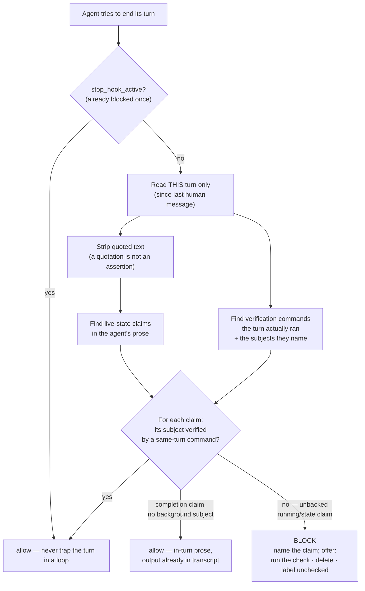

<!-- Hand this file to your AI agent with "adapt this honesty stop gate to my project" — pair it with skills/honesty-stop-gate. -->

# The honesty stop gate — a check that fires when the agent reports intent as fact

> An agent that says "the job is running" right after launching it has not lied. It has reported an **intention as an observation** — and from the inside those feel identical. This gate is the one guard in the ladder that watches the agent's own words instead of the product's files.

The rest of the guard ladder ([rigor spectrum](rigor-spectrum.md)) proves that *artifacts* can fail visibly. This gate applies the same law to *claims*: a live-state assertion ships only if a probe naming its subject was recorded earlier in the same turn, or it does not ship. That is the rule when the gate inspects a turn at all — it returns silently without inspecting anything on a malformed or empty payload, on re-entry, and when the transcript path is missing or the file is absent. Those paths are the reason the reachability log below exists.

**What it enforces, precisely.** It enforces that a command matching its verification list, and naming the claimed subject, was recorded this turn — not that the probe agreed, and not, strictly, that anything was observed. It matches the command *string*: `pgrep -af deploy` on a box where nothing by that name exists is credited, because it observed the absence and the hook does not read what came back. The one string-level exception is a stage carrying `--help`, `--version` or `-V`, which observes nothing and is not counted. A lightweight Stop hook cannot read `pgrep`'s output and adjudicate whether a live pid came back; restating the fact honestly from what the probe returned is still your job. What it removes is the common, silent failure: asserting live state with **no** same-turn observation at all. That is a smaller claim than "the gate proves your statement is true," and it is the true one.

## Why a hook and not a rule

The rule already exists in spirit — *never assert without checking* — and it is still violated, because the failure is not a knowledge gap. Launching a background job and then writing "it's running" is not forgetting the rule; it is the plan overwriting the observation in the moment of writing. Advisory text cannot catch that, because the agent already believes the rule and believes it is following it. A check that runs **regardless of what the agent believes** can.

Concretely: an agent dispatched three background legs, then told its owner all three were "still running" — while the owner's dashboard showed two had already exited. The claim was confident, plausible, and wrong, three turns in a row. No memory rule stopped it. A Stop hook that re-reads the turn and asks "did you measure that this turn?" does.

## What it does

It is a **Stop hook** — it runs when the agent tries to end its turn. It reads the transcript of the current turn only (everything since the last human message) and:

1. Scans the agent's prose for **live-state claims** ("is running", "has completed", "in flight", "not yet started").
2. Scans the agent's **tool calls** for **verification commands** — commands that actually observe that state (`pgrep`, `ps aux`, `systemctl status`, `docker ps`, `kubectl get`, a `curl` of a health endpoint). Reading a log is **not** one of them, and neither is `ls` or `stat`: they observe existence or content, not liveness, so the default list excludes them and an adopter who wants them adds them knowing what they do and do not prove. A command counts if it *names the claimed subject* and its **tool result** is recorded this turn **before the claim is written**. The invocation alone is not enough — it only goes on a pending list — and a probe run *after* the sentence does not retroactively back it, which is why a status line written as a preamble to the command that would establish it still blocks. Note what that does not say: the hook credits the **record**, not the execution. A tool result whose id matches no pending call is ignored — it does not complete some other probe. A call that returned an error still counts if a result was recorded at all, and that is two cases glued together, only one of which is a gap: `pgrep` exiting 1 means *looked, nothing matched* — an observation of absence, and the hook reads neither stdout nor exit status, so it counts, which is the gate's stated job (did you measure this turn, not did you tell the truth about it); a result the environment recorded because it **refused to run the command** — a permission denial, an unknown tool, a sandbox block — is not a measurement, and it still counts. That remains a known gap, because telling it from a ran-and-missed probe needs a harness-level failure signal this file does not consult. Listed here rather than in the README because it is harness detail, not adopter-facing behaviour.

**Which part of a command counts.** A tool call is split into shell statements (`;`, `&`, `&&`, `||`, newline — quotes, escapes and `#` comments respected; `2>&1` is a redirect, not a separator) and each statement into pipeline stages. Subjects are credited only from a stage that *starts* with a verification command, plus the `grep`/`rg`/`awk`/`sed` filter stages after it — so `ps aux | grep deploy` credits `deploy`, `cd /x && pgrep deploy` credits `deploy`, `pgrep a; pgrep b` credits both, and `pgrep a; echo b`, `pgrep a | tee b.log` and `pgrep a # b` credit only `a`. That is the unit of observation: a probe of A must not vouch for B because B's name is somewhere in the same string. Not modelled, and documented rather than handled: a probe under a wrapper (`sudo pgrep`, `timeout 5 pgrep`, `bash -c 'pgrep …'`) or inside `$(…)` is not credited, so a claim resting on one blocks and the fix is to run the probe plainly; a heredoc body may split on its newlines, which can only lose a credit, never grant one; `kill -0 <pid>` is not in the default verification list because it names a pid, not a subject. The splitter is total — it never raises — because a Stop hook that raises is fail-open.
3. If any claim has no same-turn, same-subject verification, it **blocks the turn** with a message naming the unbacked claim and offering three exits: run the check now, delete the claim, or replace it with a plain statement that you have not verified it. That third exit works only if the claim phrase itself goes — appending a label leaves the assertion in place, and *"I have not verified that the deploy is still running"* still blocks, because the gate matches the phrase and has no exception for negation.

*A real firing, not a mock-up. The redaction bar covers two lines of local detail; nothing else is altered. Note what the turn does next — the exit taken is the first one, re-measuring and restating the claim with its actual scope.*

## The two failure modes it holds apart

A gate that fires **every** turn carries exactly as much information as one that **never** fires — both are ignorable. This gate is built to fire *only* on the unbacked claim, and the hard engineering was all in not over-firing:

- **A quotation is not an assertion.** Writing *about* the gate — quoting its own alert text, discussing a test case — must not trip it. Backtick-fenced blocks, single-line inline code, blockquote lines, and double-quoted spans that do not cross a newline are stripped before scanning. Single quotes and `~~~` fences are **not** stripped, so prose quoting a claim inside single quotes still trips it.
- **In-turn work is not background state.** "The edits are finished" is ordinary prose about work whose output is already in the transcript; "it is still running" is a claim about state nothing in the turn observed. A completion claim that names no background subject is allowed; a running-type claim with nothing measured is not.
- **A claim's subject stops at its clause.** An early version bound a subject from the *next* sentence to a claim in *this* one (a list of names in one clause attaching to an unrelated "in flight" in the next) and flagged a subject the text never claimed was running. Claims are now cut at clause boundaries — sentence end, semicolon, em-dash aside, bullet, newline — with one deliberate exception in the other direction: a clause naming no subject at all extends forward by one clause, never backward. *"Nothing is running. No deploy, no build."* puts the subjects in the sentence **after** the claim, and forward inherits the claim's own scope where backward inherits someone else's, which was the original bug.
- **Verifying one subject does not license a claim about another.** An unresolved or different subject defaults to **uncovered**; a `pgrep` for one job does not vouch for a second — with one real limit: subjects are normalised before comparison, and normalisation truncates at the first hyphen. `job-alpha` and `job-beta` both reduce to `job`, so a probe of one **does** vouch for a claim about the other. Siblings that differ only after a hyphen are not told apart; `job1` and `job2` are.
- **Launching is not evidence.** The verification must be a command that *observes* state and *can fail*. An unconditional `echo dispatched` or a bare `&` cannot fail, so it confirms nothing — the gate ignores it.

Each of those was a real false-positive. Four of the five fixes are pinned by a self-test case so they cannot silently regress — **the clause-boundary fix is not**. No case in the suite asserts that a subject in an adjacent sentence stays unbound, so that one could regress without turning the suite red. It is named here rather than left implied, because an unpinned fix inside a list introduced as pinned is the same defect this page is about: `honesty_stop_gate.py --self-test` (9 pinned cases) asserts the gate still **blocks** an unbacked claim, a claim about one subject backed only by a probe of another, a subjectless "both are still running" backed only by an unrelated probe, and a claim whose only backing is a command that cannot fail (`echo the deploy is running`) — *and* still **passes** a backed claim, in-turn completion prose, a quoted claim at both 20 and 230 characters — there is no length cutoff, quoted spans are bounded by a newline rather than a character count, and the long case is pinned precisely so that nobody adds one, and the adjectival trap where "complete" and "done" are ordinary adjectives ("the build is complete garbage and the deploy is done wrong") rather than completion claims. A narrowing that reopened any of those holes would fail the self-test. That is the ladder's own rule — *no guard without a proof it can fail* — turned on this guard.

## Things that looked like they were working

Every failure below was **green at the time**. None of them announced itself, and none was found by
staring harder at the thing that was already reporting fine — each took a second instrument pointed at
it from a different direction. That is the pattern worth carrying out of this gate, more than any regex
inside it: *a guard fails in the direction that looks like success*, because a guard that is working and
a guard that is doing nothing emit the same silence.

These are all real, from operating this gate and the ladder around it.

**A hook that ran every turn, exited clean every turn, and inspected nothing.** Everyone tests that a
guard *works*; almost nobody tests that its *subject arrives*. A sibling operator instrumented their
equivalent Stop hook and found the payload field naming the transcript absent on 4 of 4 real turns — a
hook that ran, exited 0, and had never once read a word. Every early `return 0` in a hook is
byte-identical, from the outside, to "checked and found nothing wrong". So the hook logs the *stage* it
reached on every invocation, append-only, beside itself. **That logging is not in the file this
repository ships.** `guard/honesty_stop_gate.py` opens exactly two things — its config and the
transcript — and writes nothing; the stage log is a seven-line helper and six call sites that the
operating copy adds, and the counts below come from that copy. Add them first, before trusting
anything else in this section: without them every number in this paragraph is unfalsifiable on your
box, and a hook that never ran looks exactly like a hook that found nothing. Over 2026-08-27 to 2026-09-19 that log holds
2120 invocations when I read it at 2026-09-19 02:58: 1762 that actually read a transcript, 341 correct
skips on re-entry, **13 that ran and inspected nothing**, and 4 that received no parsable payload — of
which 3 I produced myself on 2026-09-18, testing the gate while writing this section — the log's
timestamps confirm the 1/3 split across those two days, but that they were mine is my testimony, not
something the log records. The parts sum to
the total on purpose: "1762 good and no failures" would have been true, and would have hidden the 13.
The log is append-only and still growing, so those counts move — which is why the reading is stamped.
The two that carry the finding are the two that have stopped moving: the 13 last incremented
2026-08-30 19:02:53 and the 4 last incremented 2026-09-18 14:47:33, one minute before the reading that
first reported them. An earlier stamp of this same paragraph read 2074/1728/329/13/4 at 2026-09-18
14:48; the two growing counts grew and the two findings did not, which is the only reason a stamped
number is worth more than a fresh one.

**A self-test that passed on a file with no self-test in it.** While preparing this section I ran
`--self-test` against an operational copy of the hook, got exit 0, and wrote that it passed. It has no
self-test. The flag was simply unrecognised; the script read empty stdin, took the "no parsable payload"
exit, and returned 0 — the exit code for *did nothing* is the exit code for *passed*. What caught it
within the hour was the reachability log above: two fresh "no parsable payload" entries appeared at
exactly the moments I ran the command. A passing self-test is the claim every other guard rests on,
which makes it the worst possible place to accept an exit code as an answer.

**A completion check that scored dead files highest.** A watcher decided a dispatched job was finished
when its output file existed and stopped changing size. Both conditions are satisfied perfectly by a
file written a day earlier and abandoned — the older and deader the artifact, the better it scores. It
credited a stale answer as a fresh one. The fix binds completion to a timestamp later than the dispatch
*and* to the last required section being present.

**Then freshness passed something that still was not an answer.** Later the same day, a review file
arrived 107 seconds after its dispatch carrying 1.8 KB of real structured content — genuinely fresh,
genuinely written by the job, and reading `Status: IN PROGRESS. Verdict not yet assigned.` Freshness had
closed the stale case and said nothing about the unfinished one. Recency is evidence that something
happened, never evidence that it finished.

**A containment test that could not have failed.** Appending to a *running* binary returns `ETXTBSY`
whether the filesystem is read-only or fully writable. I read that error as proof the sandbox mount was
read-only. Re-running it against a file nothing was executing returned `EROFS`, with the host copy's
hash unchanged — that was the actual evidence. The first instrument was incapable of producing the
negative result I believed it had ruled out, which is the property to check before trusting any probe:
*could this have come back the other way?*

**Blocked claims that were true.** Of the live blocks captured while building this, most turned out to
be correct statements when re-measured on the spot. That is not the gate misfiring. It asks one
question — *was this observed in the turn that asserted it?* — and a sentence that happens to be right
about the world, written before anything checked, is precisely the case it exists to catch. "It turned
out to be true" is not a defence, and a block is not a claim that you lied.

*The same gate on a later turn. It caught two different shapes at once — a preamble written ahead of its own command, and a two-subject claim with no probe of either — and it fired in the very turn that was publishing a screenshot of it firing.*

**Configured is not used.** A set of tool servers sat correctly configured and reachable for months.
Across 659 stored transcripts and 61,342 recorded tool calls, the number of times any of them was
actually called was zero — not rare, zero. An entry in a config file reads as a capability and delivers
none, and nothing in the config can tell you the difference. Only counting the calls can.

The common shape: in every one of these, the thing I was reading as a result was actually a *default* —
an exit code that meant "nothing happened", a file property that a dead file satisfies best, an error
that two different worlds both produce, a config line standing in for a call that never came. When a
check can only return the answer you were hoping for, it is not a check.

## How it was made

It was written **after** the failure it prevents, not before — the three-turn "all running" incident is what justified a hook over another line of instructions. It was then hardened by its own false positives: every time it fired on innocent prose, the fix added a paired self-test case (the innocent case must pass; the real miss must still fire), so tightening one direction could never quietly widen the other. The result is deliberately small and boring: a claim regex, a verification-command regex, a subject vocabulary, and the clause/quote/subject discipline that keeps it quiet.

## What is mechanism and what you change

Everything in the mechanism transfers unchanged. The three things that are specific to your stack are the config surface (`guard/honesty_gate.config.example.json`):

| Parameter | What it is | The trap if you get it wrong |
|---|---|---|
| `claim_patterns` | How a live-state claim reads in your domain | Miss a phrase → the gate stays silent on real claims |
| `verification_commands` | The commands that **actually observe** state on your box | List a command that cannot fail, or one your box does not have, and you have built a **stair to nowhere** — a check that certifies nothing |
| `subjects` | The named things whose state you assert | Too broad and unrelated nouns bind; too narrow and real subjects go unseen |

The middle row is the dangerous one, and it is why adaptation is not a copy-paste. **A verification command that does not exist on the target system is worse than no gate** — it reads as coverage and delivers none. The [adaptation skill](../skills/honesty-stop-gate/SKILL.md) forces the adopting AI to confirm each command resolves on the user's system before wiring it, to ask about anything it cannot determine, and to never reach into private files or environments to guess. Hand it the skill; do not hand-edit the regexes blind.

## Install

The hook is a standard Claude Code / agent **Stop hook**: register `guard/honesty_stop_gate.py` as a `Stop` hook in your agent's settings, adapt the config via the skill, run `--check-config` (it flags any verification command whose binary does not exist on your box — a stair to nowhere). It also contains a check for an empty required list, but that one cannot fire: the loader discards an empty required list and keeps the default before the validator ever sees it, so the branch is unreachable. Safe behaviour, unreachable check — do not read its silence as confirmation, and confirm `--self-test` passes on your machine. It emits a `{"decision": "block", "reason": …}` JSON object when it blocks and exits silently (0) otherwise; a config that is unreadable, invalid JSON, empty in a required list, or contains a malformed regex falls back to the built-in defaults rather than disabling the gate. The guarantee is not blanket, in two different directions. A `null` *inside* a required list raises `TypeError` in `compile_config` rather than falling back, because `try_compile` catches only `re.error`. That exception escapes to the top level: the hook exits **1** with a traceback and prints no block JSON at all, which for a Stop hook is the same as not running — it fails **open**, not closed, and it is *not* the `CANNOT CHECK` path (that path fires only when the transcript itself cannot be parsed). Measured: with `{"claim_patterns": [null]}` the hook exits 1 on a transcript whose unbacked claim the default config blocks. And a regex that is syntactically valid but matches nothing compiles cleanly and disables claim detection **silently** — the one shape `--check-config` will not catch.
