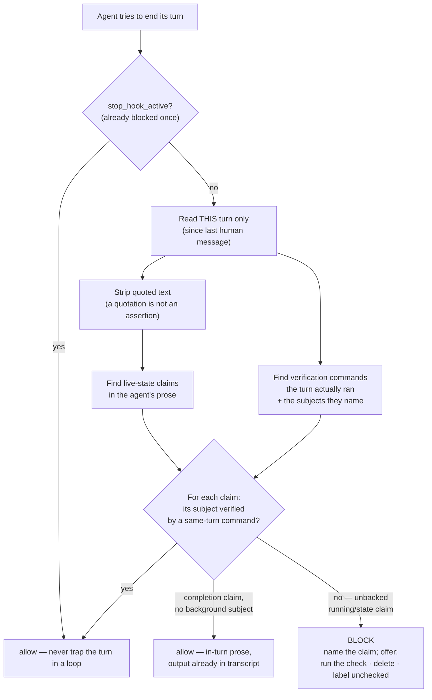

<!-- Hand this file to your AI agent with "adapt this honesty stop gate to my project" — pair it with skills/honesty-stop-gate. -->

# The honesty stop gate — a check that fires when the agent reports intent as fact

> An agent that says "the job is running" right after launching it has not lied. It has reported an **intention as an observation** — and from the inside those feel identical. This gate is the one guard in the ladder that watches the agent's own words instead of the product's files.

The rest of the guard ladder ([rigor spectrum](rigor-spectrum.md)) proves that *artifacts* can fail visibly. This gate applies the same law to *claims*: a live-state assertion ships only if a probe that observes its subject was run in the same turn, or it does not ship.

**What it enforces, precisely.** It enforces that you *ran a probe that observes the claimed subject this turn* — not that the probe agreed. A lightweight Stop hook cannot read `pgrep`'s output and adjudicate whether a live pid came back; restating the fact honestly from what the probe returned is still your job. What it removes is the common, silent failure: asserting live state with **no** same-turn observation at all. That is a smaller claim than "the gate proves your statement is true," and it is the true one.

## Why a hook and not a rule

The rule already exists in spirit — *never assert without checking* — and it is still violated, because the failure is not a knowledge gap. Launching a background job and then writing "it's running" is not forgetting the rule; it is the plan overwriting the observation in the moment of writing. Advisory text cannot catch that, because the agent already believes the rule and believes it is following it. A check that runs **regardless of what the agent believes** can.

Concretely: an agent dispatched three background legs, then told its owner all three were "still running" — while the owner's dashboard showed two had already exited. The claim was confident, plausible, and wrong, three turns in a row. No memory rule stopped it. A Stop hook that re-reads the turn and asks "did you measure that this turn?" does.

## What it does

It is a **Stop hook** — it runs when the agent tries to end its turn. It reads the transcript of the current turn only (everything since the last human message) and:

1. Scans the agent's prose for **live-state claims** ("is running", "has completed", "in flight", "not yet started").
2. Scans the agent's **tool calls** for **verification commands** — commands that actually observe that state (`pgrep`, `systemctl status`, reading a log). A command counts if a **record of it appears this turn** and it *names the claimed subject*. Note what that does not say: the hook credits the record, not the execution. A call that returned an error — including one the environment refused to run — still counts, and a tool result whose id matches no pending call is credited to the oldest one awaiting a result. Both are known gaps, listed here rather than in the README because they are harness detail, not adopter-facing behaviour.
3. If any claim has no same-turn, same-subject verification, it **blocks the turn** with a message naming the unbacked claim and offering three exits: run the check now, delete the claim, or label it plainly as unchecked.

## The two failure modes it holds apart

A gate that fires **every** turn carries exactly as much information as one that **never** fires — both are ignorable. This gate is built to fire *only* on the unbacked claim, and the hard engineering was all in not over-firing:

- **A quotation is not an assertion.** Writing *about* the gate — quoting its own alert text, discussing a test case — must not trip it. Quoted and fenced text is stripped before scanning.
- **In-turn work is not background state.** "The edits are finished" is ordinary prose about work whose output is already in the transcript; "it is still running" is a claim about state nothing in the turn observed. A completion claim that names no background subject is allowed; a running-type claim with nothing measured is not.
- **A claim's subject stops at its clause.** An early version bound a subject from the *next* sentence to a claim in *this* one (a list of names in one clause attaching to an unrelated "in flight" in the next) and flagged a subject the text never claimed was running. Claims are now cut at clause boundaries — sentence end, semicolon, em-dash aside, bullet, newline.
- **Verifying one subject does not license a claim about another.** An unresolved or different subject defaults to **uncovered**; a `pgrep` for one job does not vouch for a second — with one real limit: subjects are normalised before comparison, and normalisation truncates at the first hyphen. `job-alpha` and `job-beta` both reduce to `job`, so a probe of one **does** vouch for a claim about the other. Siblings that differ only after a hyphen are not told apart; `job1` and `job2` are.
- **Launching is not evidence.** The verification must be a command that *observes* state and *can fail*. An unconditional `echo dispatched` or a bare `&` cannot fail, so it confirms nothing — the gate ignores it.

Each of those was a real false-positive, and each fix is pinned so it cannot silently regress: `honesty_stop_gate.py --self-test` (9 pinned cases) asserts the gate still **blocks** an unbacked claim, a claim about one subject backed only by a probe of another, and a subjectless "both are still running" backed only by an unrelated probe — *and* still **passes** a backed claim, in-turn completion prose, and a quoted claim. A narrowing that reopened any of those holes would fail the self-test. That is the ladder's own rule — *no guard without a proof it can fail* — turned on this guard.

## Things that looked like they were working

Every failure below was **green at the time**. None of them announced itself, and none was found by
staring harder at the thing that was already reporting fine — each took a second instrument pointed at
it from a different direction. That is the pattern worth carrying out of this gate, more than any regex
inside it: *a guard fails in the direction that looks like success*, because a guard that is working and
a guard that is doing nothing emit the same silence.

These are all real, from operating this gate and the ladder around it.

**A hook that ran every turn, exited clean every turn, and inspected nothing.** Everyone tests that a
guard *works*; almost nobody tests that its *subject arrives*. A sibling operator instrumented their
equivalent Stop hook and found the payload field naming the transcript absent on 4 of 4 real turns — a
hook that ran, exited 0, and had never once read a word. Every early `return 0` in a hook is
byte-identical, from the outside, to "checked and found nothing wrong". So this gate logs the *stage* it
reached on every invocation, append-only, beside the hook. Over 2026-08-27 to 2026-09-18 that log holds
2067 invocations: 1726 that actually read a transcript, 327 correct skips on re-entry, **13 that ran and
inspected nothing**, and 1 that received no parsable payload. The parts sum to the total on purpose —
"1726 good and no failures" would have been true, and would have hidden the 13.

**A self-test that passed on a file with no self-test in it.** While preparing this section I ran
`--self-test` against an operational copy of the hook, got exit 0, and wrote that it passed. It has no
self-test. The flag was simply unrecognised; the script read empty stdin, took the "no parsable payload"
exit, and returned 0 — the exit code for *did nothing* is the exit code for *passed*. What caught it
within the hour was the reachability log above: two fresh "no parsable payload" entries appeared at
exactly the moments I ran the command. A passing self-test is the claim every other guard rests on,
which makes it the worst possible place to accept an exit code as an answer.

**A completion check that scored dead files highest.** A watcher decided a dispatched job was finished
when its output file existed and stopped changing size. Both conditions are satisfied perfectly by a
file written a day earlier and abandoned — the older and deader the artifact, the better it scores. It
credited a stale answer as a fresh one. The fix binds completion to a timestamp later than the dispatch
*and* to the last required section being present.

**Then freshness passed something that still was not an answer.** Later the same day, a review file
arrived 107 seconds after its dispatch carrying 1.8 KB of real structured content — genuinely fresh,
genuinely written by the job, and reading `Status: IN PROGRESS. Verdict not yet assigned.` Freshness had
closed the stale case and said nothing about the unfinished one. Recency is evidence that something
happened, never evidence that it finished.

**A containment test that could not have failed.** Appending to a *running* binary returns `ETXTBSY`
whether the filesystem is read-only or fully writable. I read that error as proof the sandbox mount was
read-only. Re-running it against a file nothing was executing returned `EROFS`, with the host copy's
hash unchanged — that was the actual evidence. The first instrument was incapable of producing the
negative result I believed it had ruled out, which is the property to check before trusting any probe:
*could this have come back the other way?*

**Blocked claims that were true.** Of the live blocks captured while building this, most turned out to
be correct statements when re-measured on the spot. That is not the gate misfiring. It asks one
question — *was this observed in the turn that asserted it?* — and a sentence that happens to be right
about the world, written before anything checked, is precisely the case it exists to catch. "It turned
out to be true" is not a defence, and a block is not a claim that you lied.

**Configured is not used.** A set of tool servers sat correctly configured and reachable for months.
Across 659 stored transcripts and 61,342 recorded tool calls, the number of times any of them was
actually called was zero — not rare, zero. An entry in a config file reads as a capability and delivers
none, and nothing in the config can tell you the difference. Only counting the calls can.

The common shape: in every one of these, the thing I was reading as a result was actually a *default* —
an exit code that meant "nothing happened", a file property that a dead file satisfies best, an error
that two different worlds both produce, a config line standing in for a call that never came. When a
check can only return the answer you were hoping for, it is not a check.

## How it was made

It was written **after** the failure it prevents, not before — the three-turn "all running" incident is what justified a hook over another line of instructions. It was then hardened by its own false positives: every time it fired on innocent prose, the fix added a paired self-test case (the innocent case must pass; the real miss must still fire), so tightening one direction could never quietly widen the other. The result is deliberately small and boring: a claim regex, a verification-command regex, a subject vocabulary, and the clause/quote/subject discipline that keeps it quiet.

## What is mechanism and what you change

Everything in the mechanism transfers unchanged. The three things that are specific to your stack are the config surface (`guard/honesty_gate.config.example.json`):

| Parameter | What it is | The trap if you get it wrong |
|---|---|---|
| `claim_patterns` | How a live-state claim reads in your domain | Miss a phrase → the gate stays silent on real claims |
| `verification_commands` | The commands that **actually observe** state on your box | List a command that cannot fail, or one your box does not have, and you have built a **stair to nowhere** — a check that certifies nothing |
| `subjects` | The named things whose state you assert | Too broad and unrelated nouns bind; too narrow and real subjects go unseen |

The middle row is the dangerous one, and it is why adaptation is not a copy-paste. **A verification command that does not exist on the target system is worse than no gate** — it reads as coverage and delivers none. The [adaptation skill](../skills/honesty-stop-gate/SKILL.md) forces the adopting AI to confirm each command resolves on the user's system before wiring it, to ask about anything it cannot determine, and to never reach into private files or environments to guess. Hand it the skill; do not hand-edit the regexes blind.

## Install

The hook is a standard Claude Code / agent **Stop hook**: register `guard/honesty_stop_gate.py` as a `Stop` hook in your agent's settings, adapt the config via the skill, run `--check-config` (it flags any verification command whose binary does not exist on your box — a stair to nowhere — and any empty required list), and confirm `--self-test` passes on your machine. It emits a `{"decision": "block", "reason": …}` JSON object when it blocks and exits silently (0) otherwise; a broken config falls back to the built-in defaults rather than disabling the gate.
